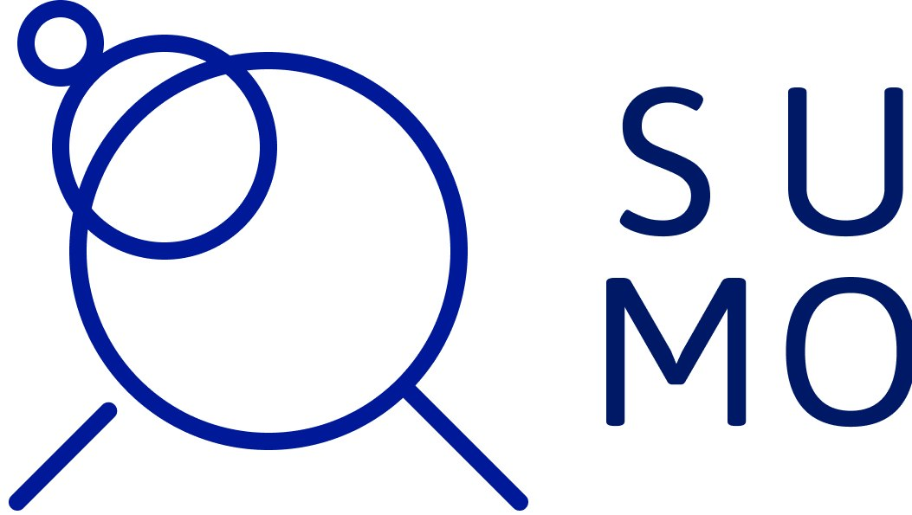
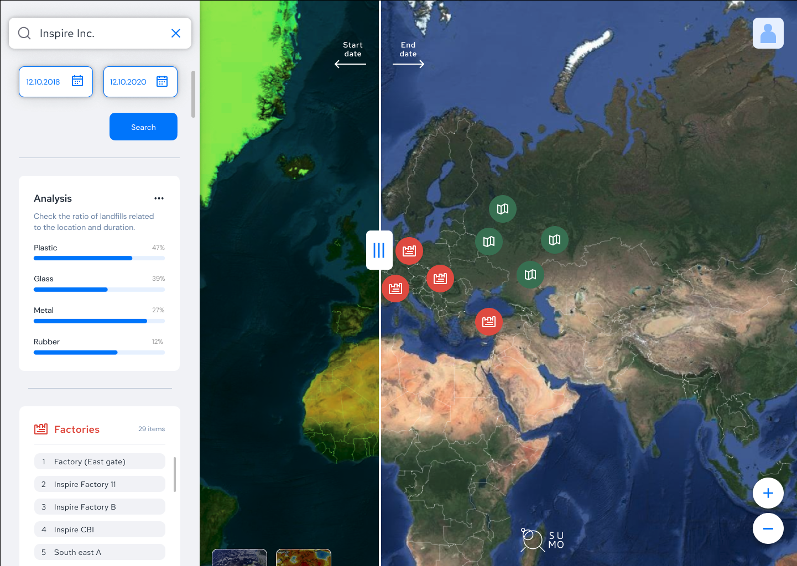

[sumo-demo]:http://ec2-3-35-22-38.ap-northeast-2.compute.amazonaws.com:3000/


<a href="http://ec2-3-35-22-38.ap-northeast-2.compute.amazonaws.com:3000/">
    
</a>


SUMO
======================

:earth_asia:  SI Analysis Track Idea Repo in [JuntionXSeoul 2020](https://app.hackjunction.com/)

🥇 1st track winner!!

[SUMO][sumo-demo] is SUstainability MOnitoring. SUMO makes it able to search for factories and check where their waste is actually going by using satellite images. It analyses the landfill locations and checks if they are actually increasing more than they should. This tool is free to use for transparency and more in-depth analysis is a paid feature for companies to further investigate their manufacturers and suppliers.


[][sumo-demo]

[Web demo][sumo-demo]


## Table of content

- [What is SUMO](#what-is-sumo)
    - [Problem](#problem)
    - [Solution](#solution)
    - [Implementation](#implementation)
    - [Challenge](#challenge)
- [SUMO Setup](#sumo-setup)
    - [Getting Started](#getting-started)
- [About Our Team](#about-our-team)
- [License](#license)
- [Links](#links)

## What is SUMO?
> SUstainability MOnitoring (SUMO).
 
### Problem

Nowadays sustainability is of the utmost importance; climate change is quickly altering our world and the pressure grows on companies to be sustainable. For this they develop goals, however it is hard to monitor if those goals are actually achieved.

### Solution

We introduce SUMO as a solution; SUMO makes it able to search for factories and check where their waste is actually going by using satellite images. It analyses the landfill locations and checks if they are actually increasing more than they should. This tool is free to use for transparency and more in-depth analysis is a paid feature for companies to further investigate their manufacturers and suppliers.


### Implementation

All of this is provided in an easy-to-use website with excellent UI and UX. We are using [React.js](https://ko.reactjs.org/) in the front-end and [Django](https://www.djangoproject.com/) + MySQL on the back-end. Furthermore the initial design has been made in [Figma](https://www.figma.com/). This made sure that we followed an user-first approach.

### Challenge

The assumption we made for [this challenge](https://drive.google.com/file/d/1Pk6kwi6ROOaeI-bI2CZsA58vWDUpQJcx/view?usp=sharing) is that the semantic change (as mentioned in the track details) is the implementation of sustainability goals of the companies; there should be a change after the introduction of that event.

## SUMO setup

### Getting Started

```bash

$ npm install -g yarn
$ yarn install
$ yarn start

```

You have to make .env file and then add REACT_APP_GOOGLE_API_KEY for using Google Map API.

### Production build

```bash

$ yarn build

```

## About our Team


> Our team name is ololo.

* Product Manager
    * [Dim Hoogeveen](https://dimhoogeveen.com/)
    
* Designers
    * [Iskhak Asanov](https://www.linkedin.com/in/iskhak-a-080466136/)
    * [Hyojin Jeon](https://preview.webflow.com/preview/hyojins-initial-project?utm_medium=preview_link&utm_source=designer&utm_content=hyojins-initial-project&preview=9764b356c66558cdfa617a5566d5c3fd&mode=preview)
    
* Developers
    * [Bong-oh Moon](https://github.com/bonomoon)(Front-end)
    * [Yongju Seong](https://github.com/Yongjuseong)(Back-end)
    * [Achamyeleh, Yonatan Gizachew](https://github.com/Emegua)(Back-end)
    
## License


## Links

* [Web site][sumo-demo]
* [Issue tracker](https://github.com/bonomoon/SUMO/issues)
* [Source code](https://github.com/bonomon)


